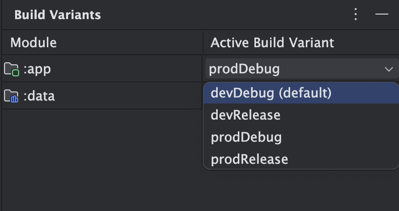

  
    
---

&nbsp; 
&nbsp; 
&nbsp; 

---

[Présentation](#android---all-in) | [Wiki](https://codefirst.iut.uca.fr/git/AllDev/Gestion_de_projet/wiki)

### Android - ALL IN!

**Contexte** : Application Android avec Jetpack Compose pour le projet universitaire de troisième année (B.U.T Informatique de Clermont-Ferrand) intitulé *All In*.
 

**Description** : Ce dépôt contient l'ensemble du code pour la partie client Android de l'application *ALL IN*.
 

## Lancement du projet 

Tout d'abord si ce n'est pas fait cloner le dépôt de la branche master/main, pour cela copier le lien URL du dépôt git :

Vous pouvez ensuite lancer l'application via l'IDE Android Studio, depuis un émulateur ou un appareil physique :

## Architecture du projet

**Build variants** : 
 - *Debug* : Version de développement, le code n'est pas minifié donc le build est rapide. Elle permet également d'avoir des fonctionnalités disponibles uniquement en développement. Par exemple, les logs de l'application et des requêtes HTTP ne sont disponibles qu'en debug.

 - *Release* : Le code est minifié et optimisé ce qui résulte en une application bien plus rapide. Cependant, le build est beaucoup plus long.

 **Build flavors** : 
 - *Dev* : La source de données injectée sont de fausses données locales.
 
 - *Prod* : La source de données injectée est l'API déployée.

 L'application existe donc en 4 versions différentes: 
 - devDebug
 - devRelease
 - prodDebug
 - progRelease

 Il est possible de choisir la version du projet avant de build dans l'onglet "build variants" d'Android studio : 
 

L'icône de l'application change en fonction du build variant, permettant de facilement les différencier lorsque plusieurs variants de l'application sont installés sur un même appareil. Un bandeau rouge "debug" est ajouté en debug, et un encart "dev" est ajouté en dev. 

  <figure>
      
      <figcaption>devDebug</figcaption>
  </figure>
  <figure>
      
      <figcaption>devRelease</figcaption>
  </figure>
  <figure>
      
      <figcaption>prodDebug</figcaption>
  </figure>     
  <figure>
      
      <figcaption>prodRelease</figcaption>
  </figure>    

  

© AllDev - Android

